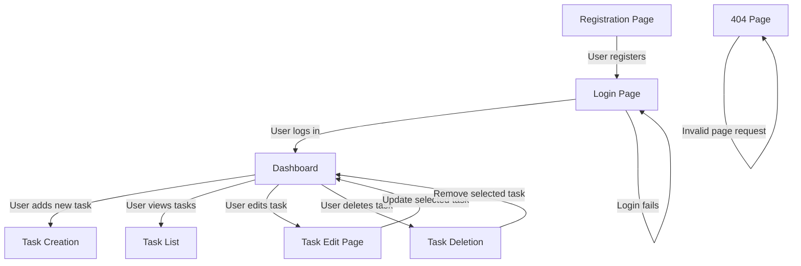

# TODO APP

A simple task management application that allows users to create, manage, and track tasks efficiently. This app provides authentication, task organization, and a user-friendly interface for seamless task handling.

## Specification

## 1. UI Pages

### pages structure



### 1.1 Registration Page

- **Features**  
  - register new user

- **Form Fields**
  - Username (Input Text)
  - Email (Input Text)
  - Password (Input Password)
  - Submit Button

### 1.2 Login Page

- **Features**
  - authenticate user

- **Form Fields**
  - Username (Input Text)
  - Password (Input Password)
  - Submit Button

### 1.3 Dashboard

- **Features**
  - Task Creation (Add new tasks)  Operations
  - Task Get/list  Operations
  - Task Update/Edit Operations
  - Task Delete/Remove Operations

### 1.3.1 Dashboard Task Edit page

- **Features**
  - update selected task

- **Form Fields**
  - Task (Input Text)
  - Is Completed (Checkbox)
  - Submit Button

### 1.4 404 page

- **Features**
  - display meaningful information for page or content not found

## 1.4 Forms

### 1.4.1 Login Form

- Username (Input Text)
- Password (Input Password)
- Submit Button

### 1.4.2 Registration Form

- Username (Input Text)
- Email (Input Text)
- Password (Input Password)
- Submit Button

### 1.4.3 Task Form

- Task (Input Text)
- Is Completed (Checkbox)
- Submit Button

## 5. Views

### 5.1 Error Handling

- **404 Page Not Found** - Render `404.html` template

### 5.2 Authentication

- **Login Page (`/login`)**
  - GET: Render login form in the `login.html`
  - POST: Authenticate user and redirect to `dashboard page`

- **Register Page (`/register`)**
  - GET: Render registration form  in the `register.html`
  - POST: Register new user and redirect to `login page`

- **Logout (`/logout`)**
  - Logs out user and redirects to `home page`

## 5.3 Home  

- **Landing Page(`/home`)** - Render `home.html` template

## 5.4 Dashboard

- **Dashboard page (`/dashboard`)**
  - GET: Render user's tasks list and display in the `dashboard.html` [edit/delete tasks included in the list]
  - GET: Render tasks form and display in the `dashboard.html`
  - POST: Add a new task

### 5.5 Task Management

- **Task Edit (`/todo/<int:todo_id>`)**
  - GET: Render task edit form  in the `edit_todo.html`
  - POST: Update or delete task

## 6. Scaffold Structure

```text
todoAppFE/
├── .gitignore               # Ignore unnecessary files
├── README.md                # Project documentation
├── specification.md         # app specification documentation
├── node_modules             # javascript library packages
├── .vscode/                 # VSCode settings
│   ├── settings.json        # Workspace settings
│   └── launch.json          # Debugging configurations
├── app/                     # Front End code 
│   ├── asssets/             # files and image location
│   │   └── images           # images location
│   ├── css/                 # Database models 
│   │   └── style.css        # general style file
│   ├── js/                  # js files location
│   │   └── app.js           # general js file  
│   ├── 404.html             # 404 error page    
│   ├── dashboard.html       # dashboard page       
│   ├── edit_todo.html       # edit todos page    
│   ├── home.html            # home page          
│   ├── index.html           # sever default page that redarects to home page         
│   ├── login.html           # sever login page     
│   └── register.html        # registeration page
├── .gitmodules              # for git sub module registry
├── live-server.config       # live server  configuration
├── package.json             # node application configuration and required app regitry manager
└──package-lock.json         # package.json lock file
```
